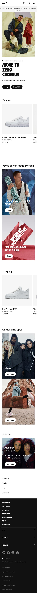
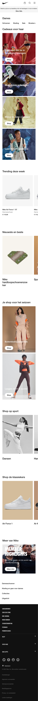
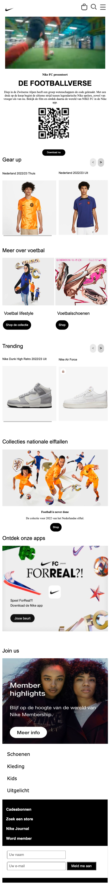
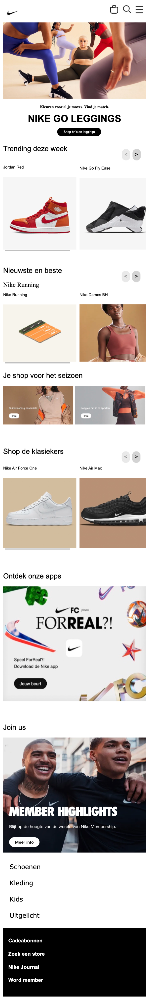

# Procesverslag
Markdown is een simpele manier om HTML te schrijven.  
Markdown cheat cheet: [Hulp bij het schrijven van Markdown](https://github.com/adam-p/markdown-here/wiki/Markdown-Cheatsheet).

Nb. De standaardstructuur en de spartaanse opmaak van de README.md zijn helemaal prima. Het gaat om de inhoud van je procesverslag. Besteedt de tijd voor pracht en praal aan je website.

Nb. Door *open* toe te voegen aan een *details* element kun je deze standaard open zetten. Fijn om dat steeds voor de relevante stuk(ken) te doen.

## Jij

  
uitwerken voor kick-off werkgroep

  ### Auteur:
  Isabel 

  #### Je startniveau:
  Blauw

  #### Je focus:
  service plain 
 

## Je website

  
uitwerken voor kick-off werkgroep

  ### Je opdracht:
  https://www.nike.com/nl/

  #### Screenshot(s) van de eerste pagina (small screen): 
  hier de naam van de pagina  
  

  #### Screenshot(s) van de tweede pagina (small screen):
  hier de naam van de pagina  
  
 

## Toegankelijkheidstest 1/2 (week 1)

  
Hier de uitwerken na test in 1e werkgroep

  ### Bevindingen
  Lijst met je bevindingen die in de test naar voren kwamen:
  - de site van nike nu is niet goed geschikt voor screenreader
  - als je over een product hovert dan verteld hij niet wat het is of waar je muis zich bevind
  - je weet niet waar je bent op een pagina
  - je kan niet zien waar je je bevind
  - 

  #### Screenreader
  Hier korte omschrijving 
  - de screenreader leest niet veel voor van de huidige website

  Hier een omschrijving van hoe het opgelost kan worden 
  - bij elk product of linkje/ button een alt tekst toevoegen zodat mensen de site wel kunnen gebruiken.

  #### Muis en Toetsenbord 
  Hier korte omschrijving (met indien nodig afbeeldingen)
  - de site beschrijft wel goed welke knoppen je moet gebruiken op je toetsenbord om terug te gaan
  - als je met je muis over het menu hovert dan zegt hij wel wat het is maar hij leest dan niet alle opties in het menu

  Hier een omschrijving van hoe het opgelost kan worden 
  - zelfde als hier voor voor alles een alt tekst toevoegen

  #### Motoriek (shocks, elastiekjes)
  Hier korte omschrijving (met indien nodig afbeeldingen)
  - we hebben geen shocks/ elastiekjes gebruikt
  Hier een omschrijving van hoe het opgelost kan worden (met indien nodig afbeeldingen)

  #### Visueel (brillen, contrast, kleurenblind, dark/light). 
  
  - er worden niet veel kleuren gebruikt de meeste kleur die wordt gebruikt is zwart en wit
  - spraak wordt niet goed gebruikt, als mensen blind zijn is het lastig om deze site te gebruiken

  Hier een omschrijving van hoe het opgelost kan worden (met indien nodig afbeeldingen)
  - Zorgen dat er altijd een goed contrast is op de website zodat mensen met kleurenblindheid ook de site makkelijk kunen gebruiken

## Breakdownschets (week 1)

  
uitwerken na afloop 2e werkgroep

  ### de hele pagina: 
  

## Voortgang 1 (week 2)

  
uitwerken voor 1e voortgang

  ### Stand van zaken
  hier dit ging goed & dit was lastig 
  - hoe ga ik er een video in krijgen
  - slider maken
  - het was weer even inkomen dus even tutorials kijken en weer opzoeken hoe alles ook al weer ging maar daarna ging het wat beter.

  ### Agenda voor meeting
  samen met je groepje opstellen

  | student 1      | student 2          | student 3    | student 4        |
  | ---            | ---                | ---          | ---              |
  | Vragen stellen | elkaar helpen      | Feedback     | en dan ik dat    |
  | vragen die op  |                    | geven aan    | dit wil ik zeker |
  | elkaar lijken  |                    | elkaar       | ...              |

  ### Verslag van meeting
  hier na afloop snel de uitkomsten van de meeting vastleggen

  - nog goed kijken naar alle punten van toegankelijkheid
  - tweede pagina maken
  - video er in zetten 

## Voortgang 2 (week 3)

  
uitwerken voor 2e voortgang

  ### Stand van zaken
  - het was lastig om de video er in te krijgen
  - had ook een fout gemaakt was sections vergeten
  - dus kon alles weer opnieuw positioneren maar dat is gelukt
  - classes gebruiken voor positioneren van tweede pagina

  ### Agenda voor meeting
  samen met je groepje opstellen

  Deze meeting was met iedereen tegelijkertijd vragen stellen en de student assistentes konden je helpen. We kregen het beoordelings forumulier en die moesten we invullen. Zo konden we zien hoe ver we al waren. 

  ### Verslag van meeting
  hier na afloop snel de uitkomsten van de meeting vastleggen

  - ik moet nog goed werken aan het toegankelijk maken
  - goed opweg 
  - menu en de twee pagina's koppen moet nog gebeuren

## Toegankelijkheidstest 2/2 (week 4)

  
uitwerken na test in 8e werkgroep

  ### Bevindingen
  Lijst met je bevindingen die in de test naar voren kwamen (geef ook aan wat er verbeterd is):

  #### Screenreader
  Hier korte omschrijving (met indien nodig afbeeldingen)
   - Op de Nike site is de tab niet heel handig nog want hij gaat eerst alle opties op je computer na en daarna pas op de site.
  - De screenreader is nog niet helemaal geschikt op mijn website want hij leest wel welke objecten er zijn maar hij leest niet alles op de site het kan bete door aan te geven welke 
  
  Hier een omschrijving van hoe het opgelost kan worden (met indien nodig afbeeldingen)
  - Ik denk dat het aan de instellingen ligt en anders aanpassen dat hij van links naar rechts automatische leest op een site en dat dus door middel van gebruik tab
  - bij elke foto en gedeelte op de site een uitgeschreven uitleg wat het is en wat het doet

  #### Muis en Toetsenbord 
  Hier korte omschrijving (met indien nodig afbeeldingen)

  Hier een omschrijving van hoe het opgelost kan worden (met indien nodig afbeeldingen)

  #### Motoriek (shocks, elastiekjes)
  Hier korte omschrijving (met indien nodig afbeeldingen)
    - Als je spasme hebt dan kan moeilijker gebruik maken van een telefoon want het is moeilijker om het goed vast te houden. Ook is het moeilijker om buttons aan te raken want je beweegt constant. 
    - Ballonnen hooghouden 
    - Het is heel lastig om op de pagina te navigeren als je ook bezig bent met het hooghouden van een ballon.
    - Als je wilt navigeren door de pagina moetje pressies werken en dat is lastig want je let op de ballon.
- Vingers vast 
    - Als je vingers vast zitten aan elkaar dan kan je minder goed navigeren omdat je een grotere vinger hebt en je kan minder precies werken.
    - Je kan wel door de pagina navigeren alleen kost het meer moeite om het in een keer goed aan te klikken.

  Hier een omschrijving van hoe het opgelost kan worden (met indien nodig afbeeldingen)
    - misschien zorgen voor voice control of een andere soort muis/ toetsenbord ?

  #### Visueel (brillen, contrast, kleurenblind, dark/light). 
  Hier korte omschrijving (met indien nodig afbeeldingen)
    - Er is slecht zicht door de brillen kleine letterts kun je niet lezen. 
    - Je moet heel erg focussen op de onderdelen die je wilt waarnemen dan zorgt de Grotte voor beperking als het Klien is kan je het namelijk niet lezen.

  Hier een omschrijving van hoe het opgelost kan worden (met indien nodig afbeeldingen)

## Voortgang 3 (week 4)

  
uitwerken voor 3e voortgang

  ### Stand van zaken
  hier dit ging goed & dit was lastig (neem ook screenshots op van delen van je website en code)
  - het grote gedeelte van de site staat
  - de puntjes die nog op de i moeten zijn:
    - Dark light mode
    - states
    - formulier net verwerken
    - goed toegankelijk maken

  ### Agenda voor meeting
  samen met je groepje opstellen
  - we hebben deze meeting weer met de gehele klas gedaan zo kon iedereen vragen stellen aan de student assistenen en we kregen feedback van de docent. Zo weet ik nu nog beter wat ik nog moet doen voor mijn beoordeling. 

  ### Verslag van meeting
  hier na afloop snel de uitkomsten van de meeting vastleggen

  - Video is gelukt
  - Fixed is gelukt
  - States gelukt

  - Form nog mooi laten tonen
  - Dark light mode nog goed verwerken
  - Nog kijken naar toegankelijkheid
  - Valideren voor einde
  - tab nav
  - bronnenlijst

## Eindgesprek (week 5)

  
uitwerken voor eindgesprek

  ### Je uitkomst - karakteristiek screenshots:
  

  ### Dit ging goed/Heb ik geleerd: 
  Korte omschrijving met plaatjes
  Dit was wel een leuke uitdaging, toen ik eerst hoorde wat we moesten gaan doen was ik best wel bang omdat ik nog niet zo goed ben in coderen. Maar toch vond ik het wel een leuke uitdaging want ik wil het graag beter kunnen. Toen heb ik gekozen voor een site die ik ook wel eens gebruik NIKE. Dit vind ik een leuke site en daar kan ik wel lang mee bezig zijn. Ik heb geleerd om een menu te maken wat in en uit klapt, dit heb ik wel geleerd met hulp van de student assisten. Ook heb ik wat nieuws geleerd hoe je dark en light modes kan toepassen. Ook heb ik een nieuwe tool geleerd van :nth-of-type() dit heeft me heel veel geholpen want eerst wist ik dit niet en nu kan ik veel makkelijker elementen aanspreken. 

  

  ### Dit was lastig/Is niet gelukt:
  Korte omschrijving met plaatjes
  Het was heel lastig om me tweede pagina vorm te geven als eerst want ik wist niet dat je class mocht gebruiken. Dus toen moest ik alles om gooien. Ik had ook wat moeite met het maken van het inklap menu maar daar heb ik hulp bij gevraagd. 

## Bronnenlijst

  
continu bijhouden terwijl je werkt

  Nb. Wees specifiek ('css-tricks' als bron is bijv. niet specifiek genoeg).

  1. Java script met hulp van Eva maar als het goed is snap ik hem wel, dat is het Menu dat in en uit klapt.
  2. Dlo sommetje 13 voor slider https://codepen.io/shooft/live/VwXXNea 
  3. https://www.w3schools.com/html/html_forms.asp voor het form zelf gekeken naar welke onderdelen ik wou in mijn form
  4. NIKE zelf voor alle foto's
  5. https://whitep4nth3r.com/blog/quick-light-dark-mode-css/ dit is een site waar ik heb gelezen hoe ik dark mode moest doen.
  

